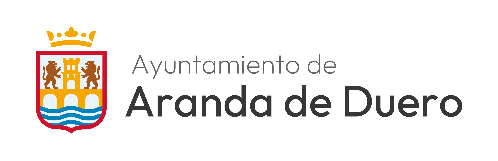

# Generador de Firmas de Correo - Ayuntamiento de Aranda de Duero

## 📧 Descripción del Repositorio

Este repositorio contiene una herramienta web interactiva para generar firmas de correo estandarizadas para los empleados del Ayuntamiento de Aranda de Duero. La aplicación permite a los usuarios crear firmas profesionales y consistentes de forma rápida, sin necesidad de conocimientos técnicos.

### ¿Qué es?

Un generador web HTML/CSS/JavaScript que proporciona una interfaz intuitiva para:

- Introducir datos personales (nombre, puesto, concejalía)
- Agregar información de contacto (teléfono, correo electrónico, ubicación)
- Seleccionar el logo corporativo correspondiente
- Previsualizar la firma en tiempo real
- Copiar el código HTML al portapapeles para usarlo directamente en clientes de correo

---

## 🎯 Beneficios de Firmas Estandarizadas

### 1. **Imagen Corporativa Profesional**

- Todas las comunicaciones por correo reflejan una imagen consistente y profesional
- Transmite seriedad y credibilidad institucional
- Los ciudadanos reciben una experiencia visual uniforme

### 2. **Identidad Institucional Fuerte**

- Uso consistente del logo y colores corporativos del Ayuntamiento
- Refuerza el reconocimiento de marca institucional
- Mejora la percepción de coherencia organizativa

### 3. **Facilita la Comunicación**

- Información de contacto siempre presente y actualizada
- Fácil acceso a teléfono, correo y ubicación
- Reduce la necesidad de incluir información redundante en el cuerpo del mensaje

### 4. **Eficiencia y Ahorro de Tiempo**

- Generación rápida de firmas sin edición manual
- No requiere conocimientos de HTML o diseño
- Actualización masiva sencilla si cambian estándares

### 5. **Reducción de Errores**

- Evita inconsistencias en formato y estructura
- Garantiza que toda información de contacto sea correcta
- Previene el uso de logos o colores incorrectos

### 6. **Mantenibilidad**

- Cambios centralizados en la aplicación benefician a todos los usuarios
- Facilita la auditoría y control de calidad de comunicaciones
- Permite evolucionar el diseño sin afectar a usuarios individuales

---

## 🛠️ Descripción Técnica

### Estructura del Proyecto

```
firmas-correo/
├── index.html              # Aplicación web principal
├── images/
│   ├── blanco/             # Logos versión blanco (para fondos oscuros)
│   └── colores/            # Logos versión color (para fondos claros)
├── LICENSE                 # Licencia del proyecto
└── README.md              # Este archivo
```

### Tecnologías Utilizadas

- **HTML5**: Estructura semántica
- **CSS3**: Estilos y diseño responsivo
- **JavaScript Vanilla**: Lógica de generación y manipulación del DOM
- **Google Fonts**: Tipografía (fuente Outfit)

### Características Técnicas

- **Interfaz responsiva**: Se adapta a dispositivos móviles y escritorio
- **Generación de HTML**: Crea código HTML limpio y compatible con clientes de correo
- **Copiar al portapapeles**: Facilita la integración con cualquier cliente de correo
- **Previsualización en tiempo real**: Los cambios se reflejan instantáneamente
- **Sin dependencias externas**: Funciona completamente en el navegador

---

## 📝 Cómo Añadir o Cambiar Concejalías

### Agregar una Nueva Concejalía

Para añadir una nueva concejalía al generador:

1. Abre el archivo `index.html`
2. Busca el elemento `<select id="concejalia">` (alrededor de la línea 227)
3. Añade una nueva línea `<option>` con la estructura siguiente:

```html
<option value="codigo-concejalía">Nombre de la Concejalía</option>
```

**Ejemplo:**

```html
<option value="cultura">Cultura y Patrimonio</option>
<option value="deportes">Deporte y Ocio</option>
<option value="educacion">Educación y Formación</option>
```

⚠️ **Notas importantes:**

- El `value` debe ser único y sin espacios (usa guiones para separar palabras)
- El texto visible es el que aparecerá en el menú desplegable
- Mantén el orden alfabético para mejor organización

---

## 🎨 Cómo Cambiar las Firmas

### Modificar la Estructura de la Firma

La firma se genera dinamicamente a partir de un template HTML. Para cambiar la estructura visual:

1. Abre `index.html`
2. Busca la sección de JavaScript (cerca de la línea 400) donde se define la función `generateSignature()`
3. Modifica el template HTML dentro de la función

**Estructura actual de la firma:**

- Logo del Ayuntamiento
- Nombre del empleado (texto en negrita)
- Puesto/Cargo
- Concejalía (en azul corporativo)
- Información de contacto (teléfono, correo, ubicación)

### Ejemplo de Modificación

Para cambiar los colores de la firma:

1. Busca la sección de estilos en `<style>` (línea 12-160)
2. Modifica las propiedades CSS relacionadas con `.email-signature`:

```css
.email-signature .name {
  font-weight: bold;
  font-size: 16px;
  color: #2c3e50; /* Cambiar este color */
}

.email-signature .concejalia {
  color: #0083c1; /* Azul corporativo */
  font-weight: 600;
  font-size: 13px;
}
```

### Cambiar el Logo

1. Reemplaza las imágenes en las carpetas:
   - `images/colores/ayuntamiento.jpg` - Logo en color (para fondos claros)
   - `images/blanco/ayuntamiento.jpg` - Logo en blanco (para fondos oscuros)

2. Mantén el mismo nombre de archivo o actualiza las referencias en el HTML:

```html

```

### Cambiar Tipografía

La aplicación actualmente usa la fuente "Outfit" de Google Fonts. Para cambiarla:

1. Localiza el import de Google Fonts (línea 7-10)
2. Reemplaza con la nueva fuente deseada
3. Actualiza la propiedad `font-family` en los estilos CSS

---

## 🚀 Cómo Usar la Aplicación

### Para los Empleados del Ayuntamiento

1. Abre el archivo `index.html` en un navegador web
2. Completa los campos obligatorios (\*):
   - Nombre completo
   - Puesto/Cargo
   - Concejalía
3. Opcionalmente, añade:
   - Número de teléfono
   - Correo electrónico
   - Ubicación/Oficina
4. Haz clic en **"Copiar Firma"** para copiar el código HTML
5. Pega la firma en tu cliente de correo (Gmail, Outlook, etc.)

### Integración con Clientes de Correo

- **Gmail**: Ajustes → General → Firma → Pegar HTML
- **Outlook**: Archivo → Opciones → Correo → Firma → Nuevo → Pegar HTML
- **Thunderbird**: Editar → Preferencias → Composición → Firmas → Pegar HTML

---

## 📄 Licencia

Este proyecto está bajo la licencia especificada en el archivo [LICENSE](LICENSE).

---

## 👥 Contacto y Soporte

Para reportar problemas, sugerencias o solicitar cambios en el generador de firmas, contacta con el departamento de TI del Ayuntamiento de Aranda de Duero.

---

**Última actualización:** 2 de febrero de 2026
